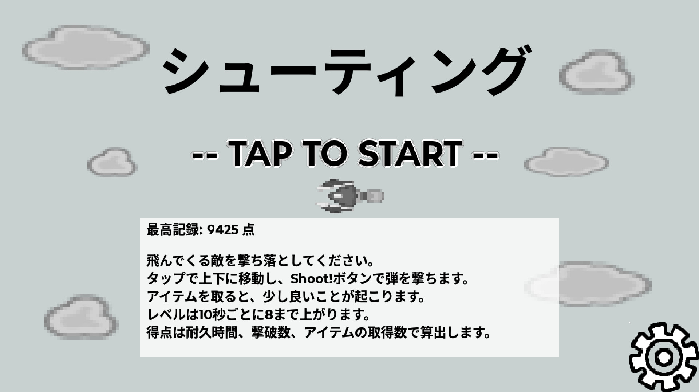
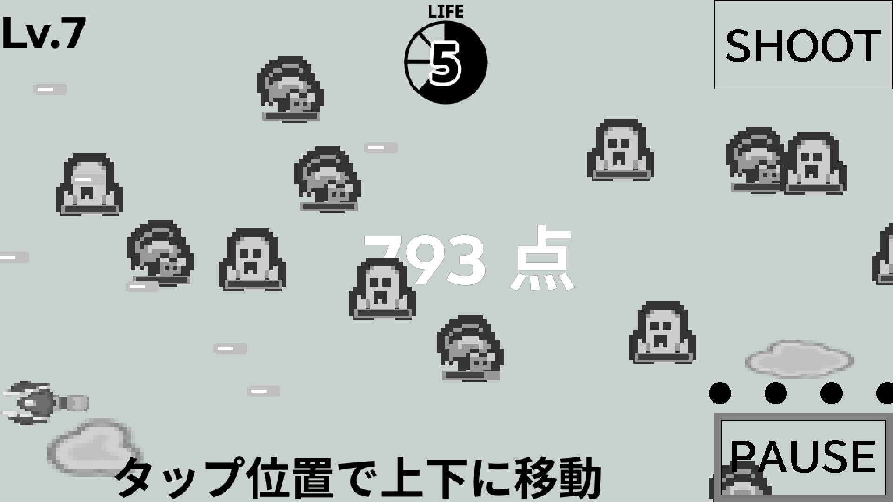
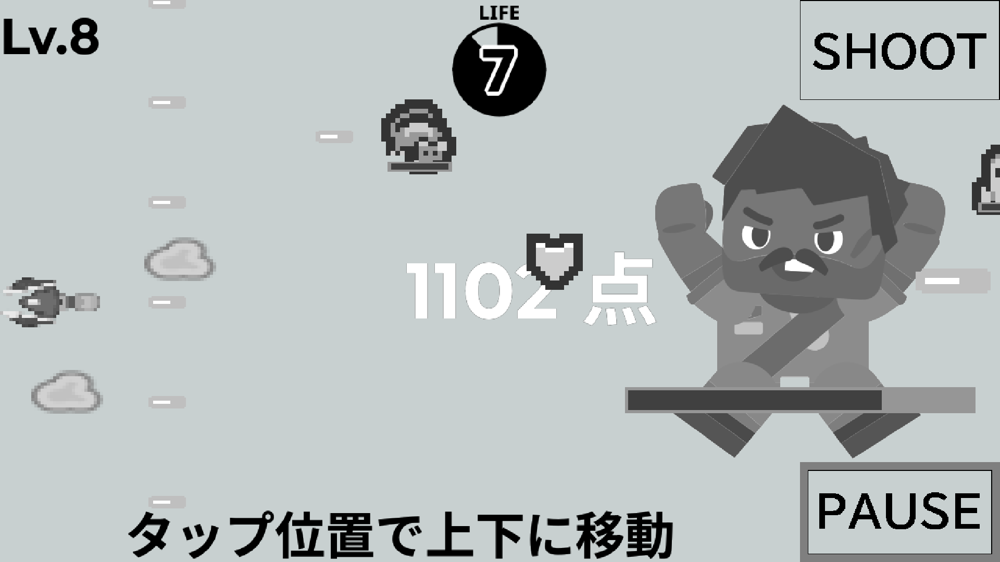
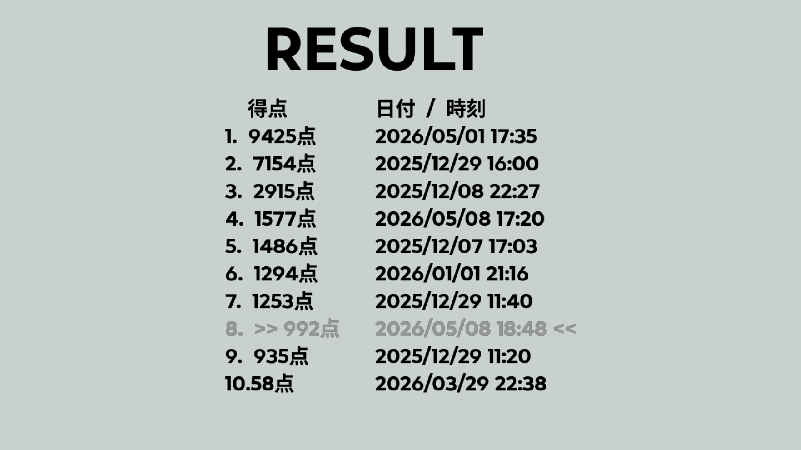

# Shooting

**English** | [日本語](README-ja.md)

[Bullet Dodge](/../dodge) | [Windows-only Version](/../legacy) | **Cross-platform Version**

This is a simple shooting game where you continuously shoot down incoming enemies. Move with the Up/Down keys or touch controls, and fire bullets with the Right key or the SHOOT button. Pause the game with the Space key or the PAUSE button. The level increases up to a maximum of 8 every 10 seconds. Enemy strength changes on odd-numbered levels and the number of enemies changes on even-numbered levels. Enemies will also shoot bullets at you starting from level 4. Picking up items grants small bonuses. Your score is calculated based on survival time, enemies defeated, and items collected.

Although you will face unavoidable situations as the game uses fairly random patterns, you have 8 lives and attack/healing items are generously provided. Once you get better at the game and consistently collect items, you can keep going almost indefinitely.

## Supported Environments

On Linux, the game can run with the [Linux runtime](https://hsp.tv/make/hsp3linux_pi.html) if the script encoding is converted to UTF-8. However, it is generally easier to run the executable through Wine or use the Web version instead (the same applies to macOS) as the setup process is rather complicated. Although the development environment supports iOS/iPadOS, no such version has been built as I do not have either a build or testing environment for them (besides, unofficial distribution is not really possible anyway...).

- Windows XP or later
  - An effective screen resolution of at least 1280x720 is required
    - Use the Web version or the [Windows-only Version](/../legacy) (Japanese environment only) if your environment does not meet this requirement
  - On devices with high-DPI displays, the game may fit on screen by right-clicking the executable, opening “Properties > Compatibility > Change high DPI settings”, enabling “Override high DPI scaling behavior”, selecting “System (Enhanced)”, and then launching the game
- Android 5 or later
  - Since the game is not distributed through the Play Store or similar services, you must enable installation from unknown sources and install the APK directly (installation via ADB is also possible)
  - On newer operating systems or devices with variable refresh rates, the frame rate may become unstable
- Modern Web Browsers [Experimental]
  - The Web version was basically built “just to see if it works,” so it may not function properly
  - Use fullscreen mode if the game extends beyond the screen (play in landscape orientation as text rendering may break if there is too much vertical space)

Please download the appropriate version from [Releases](../../releases). The Web version can be played at <https://watamario15.github.io/shooting/> (loading may take a while).

## Source Code

The source code is contained in [`shooting.hsp`](shooting.hsp), which can be opened with the script editor included in [Hot Soup Processor 3](https://hsp.tv) (the latest version including beta versions is recommended for building). Use Shift_JIS (CP932) encoding for opening if you prefer a third-party editor.

## Assets

This project was originally created during my high school years as personal practice, but it used many copyright-problematic assets at the time (You may find out from file names and the source code lol). For public release, all such assets have been replaced. Each asset has been modified as needed.

Audio assets are from [OtoLogic](https://otologic.jp/) ([CC-BY-4.0](https://otologic.jp/free/license.html)).

- [GB STG A01](https://otologic.jp/free/bgm/game-shooter-gb01.html) (`title.mp3`)
- [GB STG A02](https://otologic.jp/free/bgm/game-shooter-gb01.html) (`options.mp3`)
- [GB STG A03](https://otologic.jp/free/bgm/game-shooter-gb01.html) (`ending_bad.mp3`)
- [GB STG A04](https://otologic.jp/free/bgm/game-shooter-gb01.html) (`ending_good.mp3`)
- [GB STG A05](https://otologic.jp/free/bgm/game-shooter-gb01.html) (`bgm.mp3`)
- [GB STG A06](https://otologic.jp/free/bgm/game-shooter-gb01.html) (`bossbgm.mp3`)
- [GB STG A08](https://otologic.jp/free/bgm/game-shooter-gb01.html) (`bossclear.wav`, `gameover.wav`)
- [GB Action C02](https://otologic.jp/free/bgm/game-action-gb02.html) (`special.mp3`)
- [GB Action C08](https://otologic.jp/free/bgm/game-action-gb02.html) (`invincible.mp3`)
- [Countdown 01](https://otologic.jp/free/se/countdown01.html) (`countdown.wav`, `go.wav`)
- [SNES Shooting 01](https://otologic.jp/free/se/game-shooter01.html) (`hit.wav`, `powerdown.wav`, `powerup.wav`)
- [SNES Shooting 02](https://otologic.jp/free/se/game-shooter01.html) (`btnclick.wav`, `pause.wav`)

The following image assets are from [Kenney](https://www.kenney.nl/) ([CC0-1.0](https://www.kenney.nl/support)). All other assets are made by myself and are likewise released under CC0-1.0.

- [Space Shooter Extension](https://www.kenney.nl/assets/space-shooter-extension) (`cloud1.png`, `cloud2.png`, `player.png`)
- [Pixel Shmup](https://www.kenney.nl/assets/pixel-shmup) (`fire.png`, `invincible.png`, `lifeup.png`, `special.png`)
- [Tiny Dungeon](https://www.kenney.nl/assets/tiny-dungeon) (`enemy1.png`, `enemy2.png`)
- [Toon Characters](https://www.kenney.nl/assets/toon-characters) (`jr.png`, `kingbomb.png`, `sledgebro.png`)
- [Platformer Characters](https://www.kenney.nl/assets/platformer-characters) (`bowser2.png`, `bowser3.png`)
- [Roguelike Characters](https://www.kenney.nl/assets/roguelike-characters) (`bowser1.png`)
- [Game Icons](https://www.kenney.nl/assets/game-icons) (`back.png`, `option.png`, `reset.png`)

## Copyright

The source code is released into the public domain ([CC0-1.0](LICENSE)). Image and audio assets are licensed as described in the previous section.
